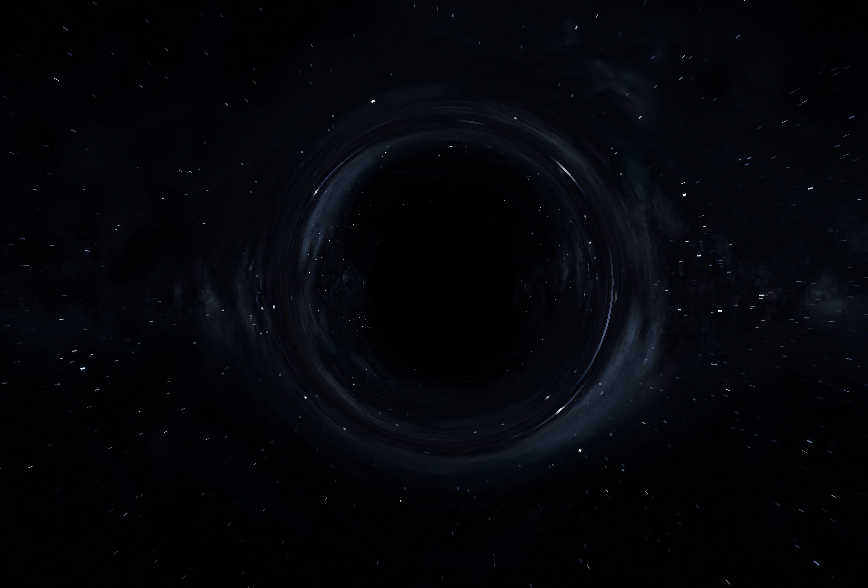
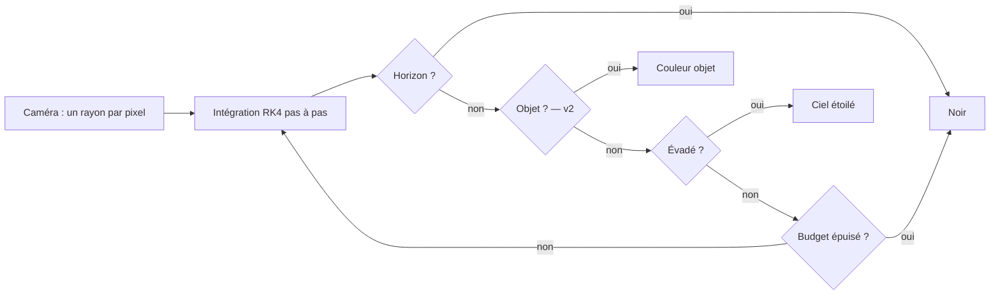
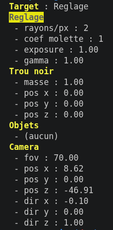
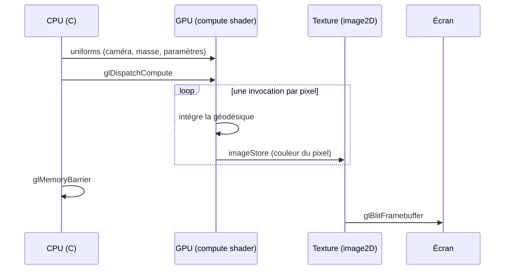

# Simulation d'espace en rendu relativiste

Simulation d'espace en C/GLSL rendue par raytracing relativiste : la lumière
est intégrée le long des géodésiques de l'espace-temps. Trous noirs,
lentilles gravitationnelles et dynamique N-corps émergent des équations —
rien n'est dessiné, tout est calculé.

Le trou noir n'est que le point de départ : c'est le cas extrême qui valide
le moteur. L'objectif est une scène spatiale complète — corps célestes,
lumière courbée, dynamique gravitationnelle — héritière du projet RT
(École 42), dont le moteur passe de l'intersection géométrique à
l'intégration numérique de trajectoires.

---


*trou noir V1*

---

## Sommaire

- [Patch Note](#patch-note)
- [Principe du moteur](#principe-du-moteur)
- [Stack technique](#stack-technique)
- [Lancer le projet](#lancer-le-projet)
- [Contrôles](#contrôles)
- [Rendu par shaders](#rendu-par-shaders)
- [Théorie](#théorie)
- [Éclairage](#éclairage)
- [Roadmap](#roadmap)
- [Pièges connus](#pièges-connus)
- [Dette technique](#dette-technique--à-retravailler-plus-tard)
- [Références à consulter](#références-à-consulter)

---

## Patch Note

### V1 — Ce qui est fait

Première version validée. Résumé, une ligne par fonctionnalité :

- Pipeline de rendu 100 % compute shader (aucun vertex/fragment).
- Caméra libre (déplacement + rotation).
- Ciel étoilé panoramique (skybox équirectangulaire) avec cache de textures.
- Théorie posée et documentée : métrique de Schwarzschild, équation de
  Binet relativiste, unités géométrisées.
- Intégration RK4 3D des géodésiques d'un photon (approche "starless"),
  pas adaptatif selon la distance au trou noir.
- Trois issues par rayon : horizon (noir), évasion (couleur du ciel),
  budget de pas épuisé.
- Silhouette du trou noir et lentille gravitationnelle visibles et
  physiquement cohérentes (pas de disque modélisé — v4).
- Supersampling (N rayons/pixel, séquence à ratio doré pour un
  échantillonnage régulier intra-pixel).
- HUD de debug terminal : arbre de valeurs par catégorie, navigation
  (`Tab` / `Entrée` / `Retour arrière`), cible surlignée.
- Édition à la molette de n'importe quelle valeur enregistrée dans
  l'arbre, avec coefficient de vitesse réglable (`Maj` + molette).
- Paramètres ajustables en direct sans recompilation (masse et position
  du trou noir, position/direction/fov caméra, nombre de rayons...).
- Exposition et gamma réglables (contrôle de la luminosité et du contraste
  perçu de l'image finale, avant affichage).

---

## Principe du moteur

1. La caméra émet un rayon par pixel (comme un raytracer classique).
2. Chaque rayon est **intégré pas à pas** le long de sa géodésique dans un
   espace-temps courbé par les masses de la scène.
3. À chaque pas, le rayon peut : franchir un horizon (**noir**), rencontrer
   un objet de la scène (**couleur de l'objet** — à partir de la v2),
   s'échapper (**fond étoilé**), ou épuiser son budget de pas.
4. Chaque rayon écrit uniquement dans **son** pixel. La déformation vient de
   *où il lit* dans la scène, jamais de *où il écrit* sur l'écran.

Simplification de la v1 : autour d'un trou noir de Schwarzschild (statique,
sans rotation), chaque rayon reste confiné dans un plan → l'intégration 3D
se réduit à une équation d'orbite 2D par rayon.



---

## Stack technique

| Composant        | Choix                                    |
|------------------|------------------------------------------|
| Langage hôte     | C                                        |
| Fenêtre / input  | SDL2                                     |
| GPU              | OpenGL + GLSL                            |
| Rendu            | Compute shader (`image2D` + `imageStore`) + blit vers l'écran |
| Physique lumière | Intégration RK4 **dans le compute shader** (1 pixel = 1 géodésique) |
| Dynamique corps  | Moteur N-corps newtonien hérité du RT (réintégré en v3) |

Le CPU orchestre : fenêtre, événements, uniforms (caméra, scène, paramètres).
La physique de la lumière vit dans le shader.

---

## Lancer le projet

### Prérequis

- Linux, avec un GPU + driver supportant OpenGL 4.3 Core.
- `libsdl2-dev` et `libgl1-mesa-dev` (headers OpenGL).

### Compilation

```sh
make
```

Compile `libft`, `librt`, puis l'exécutable `Space_Simulator`. Si SDL2 n'est
pas détecté, `make` propose de lancer `./scripts/setup.sh`, qui installe les
dépendances via `apt-get` (Debian/Ubuntu uniquement — ailleurs, installer
l'équivalent de `libsdl2-dev`/`libgl1-mesa-dev` à la main).

### Lancer

Prend en argument un fichier de scène (`.ss`, ex. `data_files/test.ss`) :

```sh
./Space_Simulator data_files/test.ss
```

### Autres cibles

- `make clean` — supprime les fichiers objets.
- `make fclean` — supprime aussi l'exécutable.
- `make re` — recompile tout depuis zéro.

---

## Contrôles

| Touche              | Action                                  |
|---------------------|------------------------------------------|
| `W` / `A` / `S` / `D` | Déplacement avant / gauche / arrière / droite |
| `Espace` / `Ctrl`   | Déplacement haut / bas                    |
| Flèches directionnelles | Rotation de la caméra (regard)       |
| `Page Up` / `Page Down` | Nombre de rayons par pixel (supersampling), min. 1 |
| `Tab`               | Navigue dans le HUD (catégorie suivante, ou valeur suivante une fois dans une catégorie) |
| `Entrée`            | Rentre dans la catégorie ciblée           |
| `Retour arrière`    | Ressort de la catégorie courante          |
| Molette souris      | Ajuste la valeur ciblée dans le HUD — le pas grandit avec le défilement continu (coefficient de vitesse `coef molette`, 1 à 5, lui-même visible/réglable dans le HUD) |
| `R`                 | Recharge la scene apres deplacement des objects de la scene depuis le HUD |
| `Échap`             | Quitter                                   |

### HUD de debug (terminal)

Pas de vrai HUD à l'écran pour l'instant : un widget dessiné (type ImGui) passerait
par le pipeline vertex/fragment classique, hors de portée tant qu'on reste dans les
clous du sujet RT (fragment shaders interdits) — remis à plus tard.

En attendant, un HUD texte tourne dans le terminal (redessiné sur place via des
séquences ANSI, pas de spam) : les valeurs de la simulation sont rangées dans un
arbre par catégorie (`Paramètres`, `Trou noir`, `Objets`, `Caméra`), chaque feuille
portant un pointeur direct vers la vraie variable (`bh.mass`, `cam.fov`, etc.) plutôt
qu'une copie. `Tab` déplace la cible affichée (`Target : ...`) à l'intérieur du
niveau courant en bouclant dessus (catégories au niveau racine, valeurs une fois
entré dans une catégorie via `Entrée`) ; la molette modifie directement la valeur
ciblée, avec un pas propre à son type (entier ou flottant) et un plancher à `0`
quand une valeur négative n'aurait pas de sens (masse, nombre de rayons).



---

## Rendu par shaders

Aucune boucle sur les pixels n'existe dans le code C : le calcul de
l'image est délégué au GPU. Le programme dispatch un compute shader écrit en GLSL
(compilé par le driver au lancement, d'où le module shader.c qui récupère les logs du
compilateur GPU) : une invocation par pixel, en parallèle, écrit directement dans une
texture via `imageStore`. Chaque invocation déduit son rayon, l'intègre le long de sa
géodésique, et écrit une couleur. L'image est ensuite présentée à l'écran par un blit
(`glBlitFramebuffer`), sans jamais passer par le pipeline vertex/fragment. Le code C
n'est que l'orchestrateur : fenêtre, événements, et envoi des uniforms (caméra, masse,
paramètres) qui alimentent le shader à chaque frame.



---

## Théorie

### Schwarzschild

`rs = 2GM/c²` — le rayon de Schwarzschild. C'est la limite en dessous de laquelle
il faudrait comprimer une masse pour qu'elle devienne un trou noir. Rien d'exotique
dans la formule en soi : n'importe quelle masse en a un, même la Terre (environ
9 mm) ou le Soleil (environ 3 km) — elles ne s'effondrent simplement jamais
jusque-là.

### Équation d'orbite d'un photon

Pour éviter de trimballer `G` et `c` partout, on choisit des unités où ils valent 1
(unités géométrisées) — ça ne change rien à la physique, juste à combien de
lettres on écrit. `rs = 2GM/c²` devient `rs = 2M`.

On part de la métrique de Schwarzschild complète :
`ds² = -(1 - rs/r) dt² + dr²/(1 - rs/r) + r²(dθ² + sin²θ dφ²)`.

Chaque terme raconte quelque chose : le premier dit que le temps s'écoule
différemment selon la distance au trou noir, le deuxième que l'espace radial se
contracte, les deux derniers décrivent la position angulaire classique en
coordonnées sphériques. Grâce à la symétrie sphérique, un rayon qui part dans un
plan y reste — le moment angulaire se conserve. On peut donc orienter les axes
pour que ce plan soit l'équateur (`θ = π/2`), ce qui tue le terme en `dθ` puisqu'il
ne bouge jamais. La métrique se simplifie tout de suite :
`ds² = -(1 - 2M/r) dt² + dr²/(1 - 2M/r) + r² dφ²`.

Un photon suit une géodésique nulle : `ds² = 0` tout au long de sa trajectoire
(contrairement à une particule massive, dont `ds²` mesure le temps propre — un
photon n'en a pas). Comme il n'a pas de temps propre pour paramétrer son chemin,
on utilise un paramètre affine `λ` quelconque : `dt = ṫ dλ`, `dr = ṙ dλ`,
`dφ = φ̇ dλ`. En remplaçant dans la métrique, chaque terme se retrouve avec un
`dλ²` en facteur qu'on peut sortir, et comme `ds² = 0` et `dλ² ≠ 0`, ce qui reste
doit valoir zéro :
`-(1-2M/r)ṫ² + ṙ²/(1-2M/r) + r²φ̇² = 0`.

C'est là qu'Euler-Lagrange devient utile : si une variable n'apparaît dans
l'équation que par sa dérivée (jamais elle-même), la quantité associée à cette
dérivée reste constante tout au long du trajet. Ni `t` ni `φ` n'apparaissent en
tant que tels — seulement `ṫ` et `φ̇` — donc on récupère deux quantités
conservées gratuitement : l'énergie du photon `E = (1-2M/r) ṫ`, et son moment
angulaire `L = r² φ̇`. En les réinjectant dans l'équation (et en éliminant `ṫ` au
passage), on arrive à :
`ṙ² = E² - (1-2M/r) × L²/r²`.

Reste à transformer ça en équation d'orbite, c'est-à-dire en `r(φ)` plutôt qu'en
fonction du temps. `ṙ/φ̇ = dr/dφ` fait disparaître `λ`, et comme `φ̇ = L/r²`, on
peut réécrire `ṙ` en fonction de `dr/dφ`. Après substitution et le changement de
variable classique en mécanique céleste (`u = 1/r`, qui simplifie beaucoup
l'algèbre), on obtient :
`(du/dφ)² = 1/b² - u² + 2Mu³`
où `b = L/E` est le paramètre d'impact — grosso modo, à quelle distance du trou
noir le rayon "viserait" s'il n'y avait pas de gravité.

Une dernière dérivation par rapport à `φ` donne la forme finale, l'équation de
Binet relativiste :
`d²u/dφ² + u = 3Mu²`

Le terme `3Mu²` à droite, c'est toute la relativité générale condensée en une
seule correction — sans lui, on retomberait sur l'équation d'une orbite
newtonienne classique.

---

## Éclairage

### Phong, pour les objets non-émissifs

Un soleil rend sa couleur directement (aucun calcul de lumière — c'est une
source, pas une surface éclairée). Tout le reste (planètes, anneaux) suit un
modèle de Phong classique : ambiante + diffuse (loi de Lambert, l'angle
entre la normale et la direction du soleil) + spéculaire (reflet concentré,
angle entre le rayon réfléchi et la caméra).

### Ombre douce analytique (soleil comme source étendue)

Une formule **analytique**, sans tirage aléatoire ni
lancer de rayon, inspirée de la méthode d'Orion Sky Lawlor pour les ombres
douces sphère-sur-sphère. L'idée : comparer des **angles**, vus depuis le
point éclairé, plutôt que chercher une intersection.

- `angle_soleil = asin(rayon_soleil / distance_soleil)` — taille angulaire
  apparente du soleil.
- `angle_occulteur = asin(rayon_occulteur / distance_occulteur)` — taille
  angulaire apparente de l'obstacle potentiel.
- `angle_sep` — l'écart angulaire entre la direction du soleil et celle de
  l'obstacle.
- `d = distance_soleil × (angle_sep − angle_occulteur)` — à quel point le
  bord de l'obstacle est loin du centre du soleil, converti en unité de
  longueur à la distance du soleil.
- `ombre = smoothstep(-1, 1, -d / rayon_soleil)` — le facteur d'ombre final
  (0 = pleine lumière, 1 = ombre totale), avec une transition douce entre
  les deux.

Le dégradé rond vient directement de cette géométrie (deux disques, projetés
en angle, qui se recouvrent progressivement) — aucun bruit, un bord net dès
`nbr_ray = 1`. Implémentée dans `sphere_light_shadow`/`accumulate_sun_light`
(`shader.comp`) ; les lumières ponctuelles classiques (`L` dans le `.ss`)
gardent le lancer de rayon d'origine (`shadow_ray`), pas de notion de disque
pour un point light.

Limites actuelles : seuls les occulteurs **sphériques** sont gérés (pas les
anneaux) ; si plusieurs objets occultent partiellement le même soleil, seule
l'ombre la plus forte est retenue (`max`), pas une vraie union des zones
occultées — négligeable tant qu'un seul obstacle significatif est présent à
la fois, ce qui couvre l'immense majorité des scènes.

La largeur de la pénombre est directement proportionnelle au rayon *réel*
du soleil (`rayon_soleil` dans la formule) — une scène où le soleil est
gros et proche des planètes (choix esthétique pour rester lisible à
l'écran, voir `data_files/solar_system.ss`) produit donc une pénombre
proportionnellement large, pas un défaut de la formule. Comparer avec
`data_files/eclipse_test.ss` (soleil petit et loin) pour voir un bord net,
comparable à une vraie ombre d'éclipse.

---

## Roadmap

### v2 — Intégration du RT : les objets entrent en scène

> Le retour du raytracer classique, mais dans un espace courbé.

- [x] Format de scène : `.ss`, sphères / planètes / anneaux / soleils avec
      nom, position, rayon, couleur, texture (chemin parsé, pas encore
      échantillonné dans le shader).
- [x] Intersection le long de la géodésique : chaque pas d'intégration est
      un petit segment quasi-droit → test d'intersection classique
      segment/objet (sphère et anneau), réutilisant les maths du RT, rejoué
      à chaque pas RK4 dans `photon_trajectory`. Objets uploadés en SSBO
      (scène statique pour l'instant, un seul upload au chargement).
- [x] Objets émissifs (soleils : couleur directe, sans éclairage) et objets
      éclairés (planètes : Phong — ambiante + diffuse + spéculaire, calculé
      au point d'impact). Ombre douce analytique pour les soleils (voir
      [Éclairage](#éclairage)) plutôt qu'un point light tout-ou-rien.
- [x] Textures planétaires (mapping sphérique, déjà connu du RT).
- [x] Cas spectaculaire validé : une planète/soleil derrière le trou noir
      apparaît déformé en arc près de l'anneau de photons (confirmé
      visuellement).

**Validation :** une scène mixte — trou noir + planètes texturées + soleil —
où les objets proches de l'horizon apparaissent distordus.

### v3 — Dynamique : l'espace s'anime

- [ ] Réintégration du moteur N-corps newtonien du RT (mis de côté, pas
      supprimé) : les corps massifs s'attirent et orbitent.
- [ ] Couplage simulation → rendu : à chaque frame, le N-corps fournit les
      positions, les uniforms les poussent au shader, le shader photographie
      l'instant.
- [ ] Intégrateur symplectique (leapfrog/Verlet) pour la stabilité des
      orbites à long terme — remplace Euler/RK4 côté dynamique.
- [ ] Scènes : système planétaire autour du trou noir, lentille
      gravitationnelle balayant le fond au passage d'un corps.

**Validation :** orbites stables sur de longues durées (énergie conservée),
animation fluide temps réel.

### v4 — Disque d'accrétion et effets relativistes

- [ ] Disque émissif dans le plan équatorial du trou noir.
- [ ] Redshift gravitationnel (la lumière s'extrait du puits → rougit).
- [ ] Beaming relativiste (asymétrie de brillance type M87 / Interstellar).

### v5 — Kerr : le trou noir en rotation

- [ ] Métrique de Kerr → la simplification « un plan par rayon » tombe :
      intégration 3D complète des géodésiques.
- [ ] Ergosphère, entraînement de l'espace-temps (frame dragging).

---

## Pièges connus

- **Debug shader :** pas de printf. Stratégie : encoder les valeurs
  suspectes dans la couleur de sortie et lire l'image.
- **Précision float :** les géodésiques proches de `b_crit` sont
  hyper-sensibles — c'est physique (instabilité de la sphère de photons),
  mais ça amplifie les erreurs numériques.
- **Pas d'intégration :** trop grand → silhouette fausse ; trop petit → GPU
  à genoux. Se règle en phase 4 contre les chiffres théoriques.
- **v2 — intersections manquées :** un pas trop grand peut « sauter »
  par-dessus un objet fin ; borner la taille du pas par la taille du plus
  petit objet proche.
- **v2 — faux négatifs d'intersection sur la frontière entre deux pas :**
  `hit_sphere` reprenait la garde anti-auto-intersection classique du RT
  (`t < 0.0001` rejeté), utile quand un rayon repart *depuis* la surface
  d'un objet (réflexion, ombre). Ici les segments testés partent d'un point
  RK4 quelconque en plein espace, jamais d'une surface : la garde rejetait
  des `t` valides pile à la coïncidence entre la fin d'un segment et le
  début du suivant, laissant le rayon traverser l'objet sans le toucher sur
  certains pixels — anneau de pixels « invisibles » autour des sphères,
  dépendant de la distance à la caméra. Fix : garder seulement
  `t < 0.0 || t > 1.0`, sans marge — la garde miniRT n'a pas de raison
  d'être sur un segment qui ne part jamais d'une surface.
- **Performance :** si le temps réel décroche, réduire la résolution interne
  et upscaler avant de toucher au pas d'intégration.
- **Anneaux mal éclairés (normale à sens unique) :** un anneau a deux faces,
  mais `ring.normal` ne pointe que d'un côté. `coef_dif = dot(normale,
  direction_soleil)` peut donc être négatif pour la face pourtant visible
  par la caméra, si `normal` pointe à l'opposé du soleil — l'anneau ne
  reçoit alors que l'ambiante (quasi noir). Déjà repéré en commentaire dans
  `accumulate_light`/`accumulate_sun_light` (`shader.comp`) ; fix identifié
  mais pas encore appliqué : `abs(coef_dif)` quand l'objet touché est un
  anneau.

## Dette technique — à retravailler plus tard

Compromis acceptés consciemment pour avancer, à revisiter quand le besoin
deviendra bloquant (pas des bugs à corriger dans l'immédiat).

- **Caméra libre — dérive de roulis vs boucle complète verticale :**
  `calcul_viewport` reconstruit `hor_n` à partir de sa propre valeur
  précédente plutôt que de se recaler sur `up` — choix délibéré pour
  permettre une boucle complète (regarder droit vers le haut et continuer)
  sans singularité de type gimbal lock. Coût : une légère dérive de roulis
  s'accumule sur des rotations combinées prolongées (haut/bas + gauche/droite
  enchaînés). Vraie solution : orientation par quaternion (ni dérive, ni
  singularité aux pôles) — demande d'ajouter la multiplication de quaternions
  et la rotation d'un vecteur par quaternion à la `librt`, pas encore fait.

- **Scintillement près de l'anneau de photons :** les pixels dont le rayon
  passe très proche de `b_crit` scintillent d'une frame à l'autre — un rayon
  peut faire un tour de plus ou de moins autour du trou noir pour un
  déplacement infime de la caméra ou une infime différence de précision
  flottante, renvoyant une couleur de ciel complètement différente. C'est
  physique (instabilité de la sphère de photons, déjà notée dans "Pièges
  connus"), amplifié par l'absence de supersampling (un seul rayon par
  pixel, alors que c'est justement la zone la plus "magnifiée" par la
  lentille). Vraie solution : supersampling (Phase 5) — moyenner plusieurs
  rayons par pixel lissera cette instabilité locale.

- **Résolution interne réglable (perf sous charge) :** pour l'instant la
  seule protection contre une charge GPU excessive est le supersampling
  (`nbr_ray`, borné à 1 minimum) — pas de garde-fou dans l'autre sens. Le
  besoin viendra avec la v3 (N-corps) : si la caméra doit rester fluide
  pendant que le GPU est aussi sollicité par la dynamique, il faudra pouvoir
  descendre sous 1 rayon par pixel. Piste envisagée puis écartée pour
  l'instant : partager un rayon entre plusieurs pixels voisins (ex. 1 pour 4)
  directement dans la grille pleine résolution — rejetée à cause de la
  divergence de warp (les invocations "meneuses" et "suiveuses" mélangées
  dans le même warp/wavefront font attendre tout le paquet, donc gain quasi
  nul en pratique). Vraie solution : rendre dans une texture plus petite
  (dispatch réduit, ex. `taille/2` dans chaque dimension) puis upscaler au
  `glBlitFramebuffer` (qui scale nativement src→dst de tailles différentes,
  `GL_NEAREST` pour rester cohérent avec l'esthétique pixelisée) — un vrai
  quart des invocations, sans divergence. Orthogonal au supersampling : les
  deux réglages (résolution interne, `nbr_ray`) pourront cohabiter et se
  piloter indépendamment selon la charge du moment.

- **Trou noir traité à part, hors du buffer d'objets (v2) :** les objets de
  scène (sphères, anneaux, planètes) sont testés par intersection le long
  de la géodésique via un buffer GPU (SSBO) ; le trou noir n'y figure pas —
  il courbe la trajectoire (uniforms `bh_mass`/`bh_pos` dédiés dans
  `photon_trajectory`), il ne se "touche" pas comme les autres objets. Choix
  délibéré : essayer d'unifier les deux dans une même structure maintenant
  reviendrait à deviner la forme d'un problème pas encore posé — la v3
  (N-corps, "les corps massifs s'attirent et orbitent", au pluriel) va de
  toute façon réécrire en profondeur l'intégration de la courbure (`h2`
  conservé suppose une masse centrale unique ; plusieurs masses cassent
  cette hypothèse et demandent une somme de forces en 3D, pas juste un
  tableau de plus) — la v4 (disque) et la v5 (Kerr) touchent aussi la partie
  gravité/métrique, jamais la structure du buffer d'objets. Cohérent avec ça,
  le trou noir est sorti de l'union `t_object` et traité comme les soleils :
  son propre tableau dans `t_simulation`, pas un type d'objet parmi d'autres.

- **Textures d'objets — tableau borné (`sampler2D obj_textures[N]`), pas
  illimité comme côté C :** un `sampler2D` est un type opaque (lié à une
  unité de texture matérielle), impossible à stocker dans un SSBO comme une
  donnée — un objet référence sa texture par index dans ce tableau plutôt
  que directement. `N` dimensionné sur le nombre réel d'unités de texture
  de la machine, pas un chiffre arbitraire — largement suffisant pour une
  scène planétaire. Écarté : bindless textures (lèverait la limite, mais
  l'extension n'est pas dans le build glad actuel, portabilité incertaine
  hors NVIDIA) et texture array (lèverait aussi la limite, mais impose la
  même résolution à toutes les textures — mauvais si une scène mélange une
  grosse planète et une petite lune).

## Références à consulter

- Textures : NASA SVS *Deep Star Maps* (domaine public) ; textures
  planétaires libres (mots-clés *planet texture equirectangular*).
- Théorie : chapitres « orbites de photons / métrique de Schwarzschild »
  d'un cours introductif de relativité générale ; mots-clés
  *photon geodesics Schwarzschild ray tracing*.
- Pour se situer : l'article technique de l'équipe d'*Interstellar*
  (Double Negative / Kip Thorne) sur leur moteur de rendu gravitationnel.
